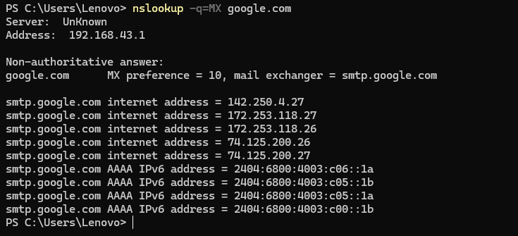
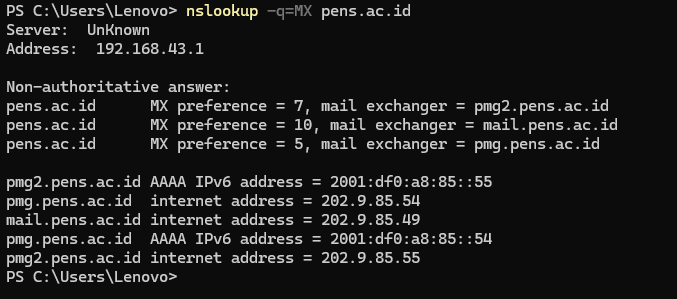

# Rangkuman Mail Server

## Protokol Mail

Mail protocol adalah sekumpulan aturan yang digunakan untuk mengirim, menerima, dan mengelola email di jaringan. Tiga protokol utama adalah:
- `SMTP` (Simple Mail Transfer Protocol)
- `IMAP` (Internet Message Access Protocol)
- `POP3` (Post Office Protocol version 3)

Ada juga versi aman dari `POP3`, yaitu `POP3S`.

---

### SMTP (Simple Mail Transfer Protocol)

**Fungsi utama**: Mengirim email dari client ke mail server, atau antar mail server.

**Port standar**:
- Port 25 (umum, tidak terenkripsi)
- Port 587 (dengan STARTTLS - aman)
- Port 465 (dengan SSL/TLS - aman)

**Sifat protokol**: Push protocol → hanya untuk pengiriman email, bukan menerima.

**Contoh alur kerja**:
1. User mengirim email via aplikasi email (client) ke SMTP server.
2. SMTP server mengirim ke mail server tujuan.
3. Penerima mengambil email melalui POP3 atau IMAP.

---

### POP3 (Post Office Protocol version 3)

**Fungsi utama**: Mengambil email dari server ke perangkat client.

**Port standar**:
  - Port 110 (tidak terenkripsi)

**Sifat protokol**: *Pull protocol* dan *store-and-forward*

**Karakteristik**:
- Email diunduh ke client dan biasanya dihapus dari server.
- Tidak mendukung sinkronisasi antar perangkat.
- Cocok jika email hanya diakses dari satu perangkat.

---

### IMAP (Internet Message Access Protocol)

**Fungsi utama**: Mengelola dan membaca email langsung dari server.

**Port standar**:
- Port 143 (tanpa enkripsi)
- Port 993 (dengan SSL/TLS)

**Sifat protokol**: *Two-way sync*

**Karakteristik**:
- Email tetap tersimpan di server.
- Mendukung akses dari beberapa perangkat sekaligus.
- Perubahan di satu perangkat disinkronkan ke server dan perangkat lain.

---

### POP3S (POP3 Secure)

**Fungsi utama**: Sama seperti POP3, tetapi menggunakan koneksi aman (SSL/TLS).

**Port standar**:
- Port 995

**Keunggulan**:
- Enkripsi komunikasi antara client dan server.
- Aman digunakan di jaringan publik.

---

### Perbandingan SMTP, POP3, POP3S, dan IMAP

| Fitur                        | SMTP             | POP3             | POP3S               | IMAP                 |
|------------------------------|------------------|------------------|---------------------|----------------------|
| Fungsi utama                 | Kirim email      | Ambil email      | Ambil email aman    | Ambil & kelola email |
| Port default                 | 25 / 587 / 465   | 110              | 995                 | 143 / 993            |
| Arah komunikasi              | Client → Server  | Server → Client  | Server → Client     | Server ↔ Client      |
| Sinkron antar perangkat      | X                | X                | X                   | √                    |
| Email disimpan di server     | X                | X (biasanya)     | X (biasanya)        | √                    |
| Enkripsi data                | Opsional         | X                | √                   | √ (port 993)         |
| Cocok untuk                  | Pengiriman       | Satu perangkat   | Satu perangkat aman | Multi perangkat      |

## Mail Server dalam Domain

`MX`(Mail Exchange) Record adalah jenis DNS record yang menentukan server mana yang menerima email untuk domain tertentu.

Untuk dapat melihat mail server pada sebuah domain, kita bisa mencobanya dengan perintah `nslookup` seperti berikut:
```bash
nslookup -q=MX [nameserver]
```

Contoh:
- google.com

  

  Dari output `nslookup` di atas dapat dilihat bahwa Mail Exchanger dari `google.com` adalah `smtp.google.com`

- pens.ac.id

  

  Dari output `nslookup` di atas dapat dilihat bahwa `pens.ac.id` memiliki 3 Mail Exchanger, yaitu:
  - `pmg2.pens.ac.id`
  - `mail.pens.ac.id`
  - `pmg.pens.ac.id`


## *Introduction to Electronic Mail*


### Komponen Utama Email
1. **Alamat Email**: Identifikasi unik untuk setiap pengguna, biasanya dalam format `nama@domain.com`.
2. **Klien Email**: Perangkat lunak untuk mengirim, menerima, dan mengelola email, seperti Gmail, Outlook, atau Apple Mail.
3. **Server Email**: Sistem komputer yang menyimpan dan meneruskan email ke penerima yang dituju.

### Proses Pengiriman Email
1. Menyusun pesan baru di klien email.
2. Memasukkan alamat email penerima di bidang "To".
3. Menambahkan subjek untuk merangkum isi pesan.
4. Menulis isi pesan.
5. Melampirkan file jika diperlukan.
6. Mengklik "Send" untuk mengirim pesan ke server email penerima.

### Komponen Sistem Email
1. **User Agent (UA)**: Program yang digunakan untuk mengirim dan menerima email; juga dikenal sebagai mail reader.
2. **Message Transfer Agent (MTA)**: Bertanggung jawab untuk mentransfer email dari satu sistem ke sistem lain menggunakan protokol seperti SMTP.
3. **Mailbox**: File pada hard drive lokal yang menyimpan email yang diterima.
4. **Spool File**: File yang berisi email yang akan dikirim; UA menambahkan email keluar ke file ini, dan MTA mengekstrak email untuk dikirim.

### Alur Pengiriman/Penerimaan Email
1. User mengirimkan mail dari User Agent
2. Mail yang dibuat akan disimpan sementara di Spool
3. Kemudian alamat email akan diperiksa atau diubah oleh Alias Expander berdasarkan data dari Database
4. Lalu Alias Expander akan meneruskannya ke MTA Client
5. Setelah itu, mail akan diteruskan ke Internet untuk dihantarkan ke MTA Server Penerima
6. Setelah diterima, MTA akan meneruskan mail ke Alias Expander untuk diproses dengan mencari tujuan dari mail
7. Kemudian mail akan disimpan ke Mailbox penerima
8. Dan mail dari pengirim dapat diakses penerima melalui User Agent penerima
