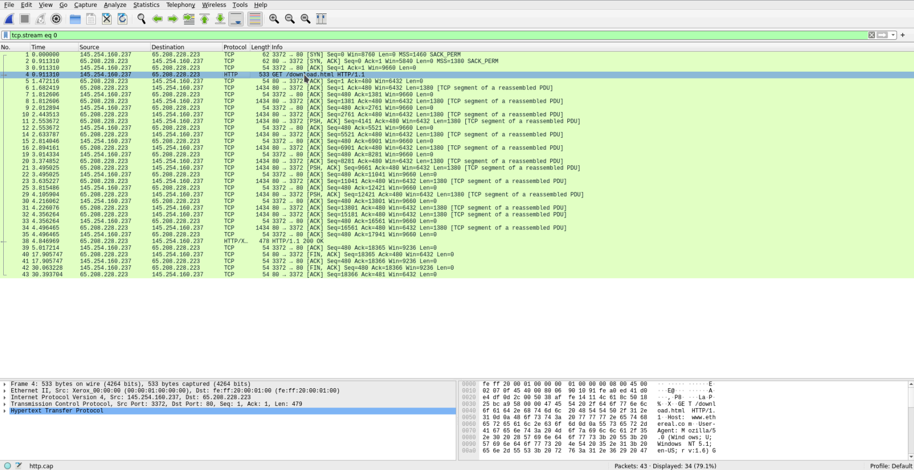
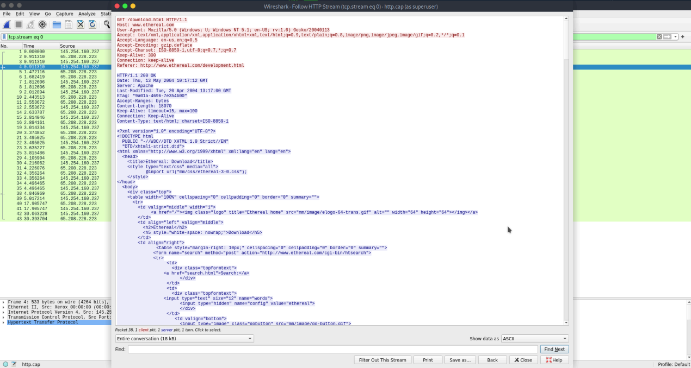
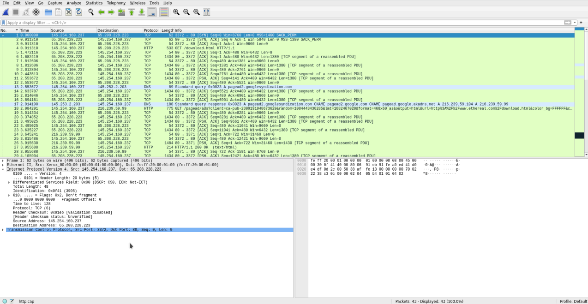
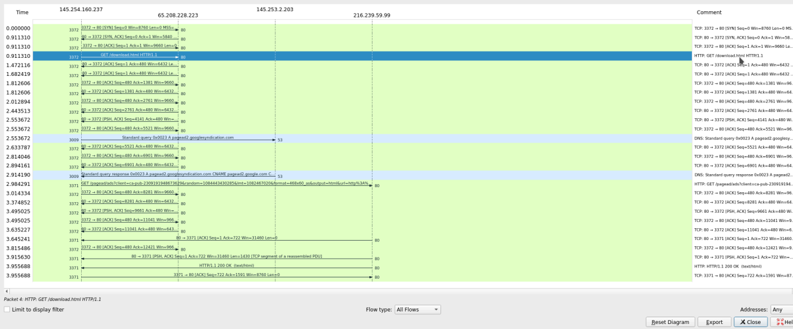
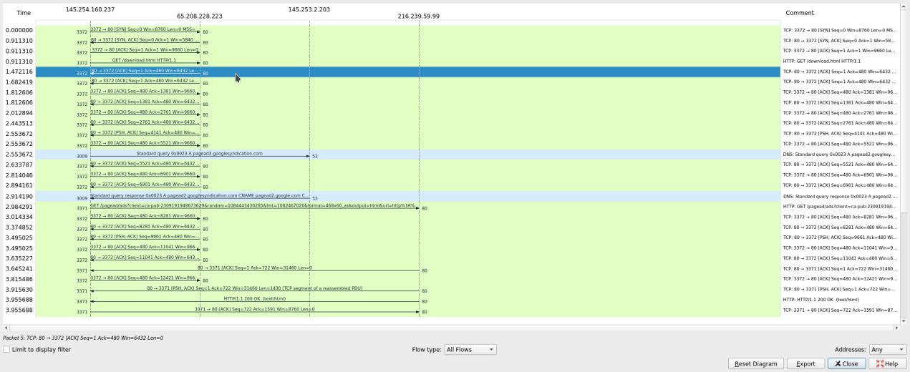
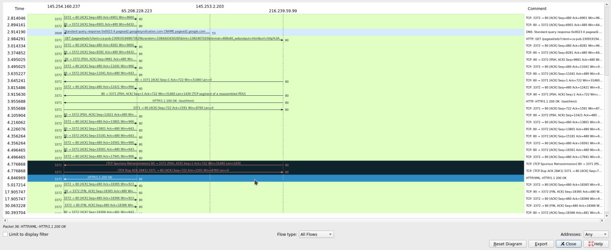
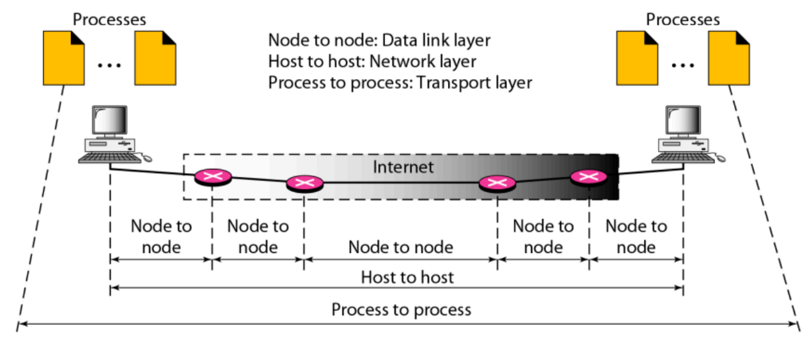

# Review - Workshop Adminsitrasi Jaringan

- [TUGAS 1: Analisa file http.cap](#tugas-1-analisa-file-httpcap)
  - [Versi HTTP yang digunakan](#a-versi-http-yang-digunakan)
  - [IP Address dari client dan server](#b-ip-address-dari-client-dan-server)
  - [Waktu dari client mengirimkan HTTP request](#c-waktu-dari-client-mengirimkan-http-request)
  - [Waktu dari server menerima HTTP request dari client](#d-waktu-dari-server-menerima-http-request-dari-client)
  - [Waktu yang dibutuhkan untuk transfer dan response dari client ke server](#e-waktu-yang-dibutuhkan-untuk-transfer-dan-response-dari-client-ke-server)
- [TUGAS 2: Analisa Gambar Types of Data Deliveries](#tugas-2-analisa-gambar-types-of-data-deliveries)
  - [Node to node](#node-to-node)
  - [Host to host](#host-to-host)
  - [Process to process](#process-to-process)
- [TUGAS 3: Resume Tahapan TCP](#tugas-3-resume-tahapan-tcp)
  - [Connection Establishment](#connection-establishment)
  - [Data Transfer](#data-transfer)
  - [Connection Termination](#connection-termination)

## TUGAS 1: Analisa file http.cap

### A. Versi HTTP yang digunakan
Untuk dapat melihat versi HTTP yang digunakan pada file http.cap tersebut, pertama kita dapat memilih salah satu packet HTTP atau TCP yang ada

Kemudian klik kanan pada salah satu packet dan pilih `Follow` > `HTTP Stream`
Maka akan ditampilkan sebagai berikut

Pada tampilan HTTP Stream yang ditampilkan dapat terlihat beberapa informasi mengenai data mengenai packet HTTP yang ditransmisikan. Pada tampilan HTTP Stream di atas, dapat terlihat bahwa versi HTTP yang digunakan adalah `HTTP/1.1`

### B. IP Address dari client dan server
Pada file http.cap, kita dapat melihat informasi IP Address dari client dan server langsung pada packet pertama pada file tersebut

Pada tiga packet pertama, dapat kita lihat, ketiga packet tersebut menunjukkan proses TCP three way handshake dan pada packet pertama dapat kita lihat source address dan destination addressnya. Untuk Source Address menunjukkan IP Address dari client, sedangkan untuk Destination Address menunjukkan IP Address dari server.
- Client IP Address : `145.254.160.237` 
- Server IP Address : `65.208.228.223`

### C. Waktu dari client mengirimkan HTTP request
Pada menu bar di bagian atas, kita dapat memilih menu `Statistic` > `Flow Graph` untuk melihat alur dari packet-packet yang dikirimkan seperti berikut:

Untuk mengetahui kapan waktu dari client mengirimkan HTTP request, dapat kita lihat pada packet yang berisi `HTTP GET`, dan pada sisi kiri dari Flow Graph menunjukkan kapan waktu packet tersebut dikirimkan, yaitu `0.911310` detik dari awal packet capture dijalankan.

### D. Waktu dari server menerima HTTP request dari client

Sedangkan untuk waktu dari server untuk menerima packet `HTTP GET` dari client sebelumnya ada pada packet selanjutnya, yaitu packet `ACK` dari server pada gambar di atas yang waktunya menunjukkan `1.472116` detik dari awal packet capture dijalankan.

### E. Waktu yang dibutuhkan untuk transfer dan response dari client ke server
Untuk mengetahui waktu yang dibutuhkan dari awal client request hingga server response, dapat kita lihat dari waktu response dari server dikirimkan

Dapat dilihat bahwa packet `HTTP OK` yang merupakan response dari server ke client request dikirimkan pada waktu `4.846969` detik dari awal packet capture. Untuk mendapatkan waktu yang dibutuhkan untuk transfer dan response dapat dihitung dari waktu packet `HTTP GET` dikirim hingga packet `HTTP OK` dikirimkan. Maka dapat dihitung sebagai berikut:
- Waktu packet `HTTP GET` dikirim : `0.911310`
- Waktu packet `HTTP OK` dikirim : `4.846969`
- Selisih : `4.846969` - `0.911310` = `3.935659` detik

## TUGAS 2: Analisa Gambar Types of Data Deliveries

Pada gambar di atas, terdapat 3 tipe penghantaran data, Node, to node, Host to host, dan Process to process.

### Node to node
Pada data delivery node to node, data dikirim antara perangkat dalam satu jaringan fisik atau segment jaringan yang sama, delivery node to node beroperasi hanya hingga layer ke 2 OSI Layer, yaitu `Data Link Layer`. Dalam delivery ini, yang digunakan sebagai pengalamatan adalah `MAC Address`. Sebagai contoh di gambar, data delivery antara PC ke Router dan Router ke Router digolongkan sebagai node to node delivery.
  
### Host to host
Pada data delivery host to host, data dikirimkan dari satu perangkat ke perangkat lain di jaringan yang berbeda, delivery host to host beroperasi hingga layer ke 3 OSI Layer, yaitu `Network Layer`. Dalam delivery ini, yang menjadi pengalamatan adalah `IP Address`. Pada gambar di atas, data delivery dari PC ke PC pada jaringan yang berbeda termasuk dalam host to host delivery

### Process to process
Pada data delivery process to process, data dikirim antara proses atau aplikasi yang berjalan pada perangkat yang berbeda, delivery process to process beroperasi hingga layer ke 4 OSI Layer, yaitu `Transport Layer`. Process to process delivery menggunakan `nomor port` untuk pengalamatan prosesnya. Contoh dari delivery ini adalah komunikasi antara web browser dan web server.

## TUGAS 3: Resume Tahapan TCP
**TCP** (Transmission Control Protocol) adalah protokol komunikasi berbasis koneksi yang memastikan pengiriman data secara andal (reliable). Proses komunikasi dalam TCP terdiri dari 3 tahapan yaitu:

### Connection Establishment
Sebelum data dapat dikirim, client dan server harus memastikan koneksi terlebih dahulu melalui proses `three-way handshake`. Proses ini memastikan baik client maupun server siap untuk berkomunikasi.
1. **SYN**
- Client mengirimkan packet `SYN` ke server untuk menginisiasi koneksi
3. **SYN-ACK**
- Server menerima packet `SYN` dari client dan membalasnya dengan packet `SYN-ACK`
3. **ACK**
- Client mengirimkan packet `ACK` sebagai konfirmasi penerimaan `SYN-ACK` dari server
Setelah packet `ACK` diterima oleh server, koneksi dianggap sudah aktif dan siap untuk berkomunikasi

### Data Transfer
Setelah koneksi terbentuk, client dan server dapat mulai berkomunikasi dan mulai bertukar data. TCP memastikan data dikirim dengan andal melalui beberapa mekanisme:
- Numbering & Acknowledgement
- Sliding Window Protocol
- Retransmission & Timeout
- Flow Control
- Congestion Control

### Connection Termination
Ketika komunikasi selesai, koneksi TCP harus ditutup dengan aman melalui proses `four-way handshake` dengan tahapan berikut:
1. **FIN**
- Salah satu pihak (bisa client ataupun server) mengirimkan packet `FIN` untuk meminta penutupan koneksi.
2. **ACK**
- Pihak penerima packet FIn akan mengirimkan packet `ACK` untuk mengkonfirmasi permintaan penutupan koneksi, namun disini penerima masih bisa mengirim data yang tersisa sebelum benar-benar ditutup.
3. **FIN**
- Setelah semua data selesai dikirim, pihak penerima `FIN` juga akan mengirimkan packet FIN kembali untuk menutup koneksi dari sisinya.
4. **ACK**
- Pengirim `FIN` pertama akan mengirimkan packet `ACK` terakhir sebagai konfirmasi untuk menutup koneksi.

Connection termination ini dapat dilakukan dari sisi client maupun server, jika dari sisi client, yang pertama mengirimkan packet `FIN` adalah client dan yang mengirim packet `ACK` terakhir adalah server. Contoh dari connection termination dari client adalah pada koneksi `SSH` saat client ingin mengakhiri sesi.

Sebaliknya jika dari sisi server, yang pertama akan mengirimkan packet `FIN` adalah server dan yang mengirim packet `ACK` terakhir adalah client. Contoh connection termination dari server adalah dalam koneksi `HTTP/1.1` saat setelah beberapa waktu tidak ada aktivitas dari client, server akan menutup koneksi.
