# DNS Server

## Configure for Internal Network

### [1] Install BIND

```bash
apt -y install bind9 bind9utils
```
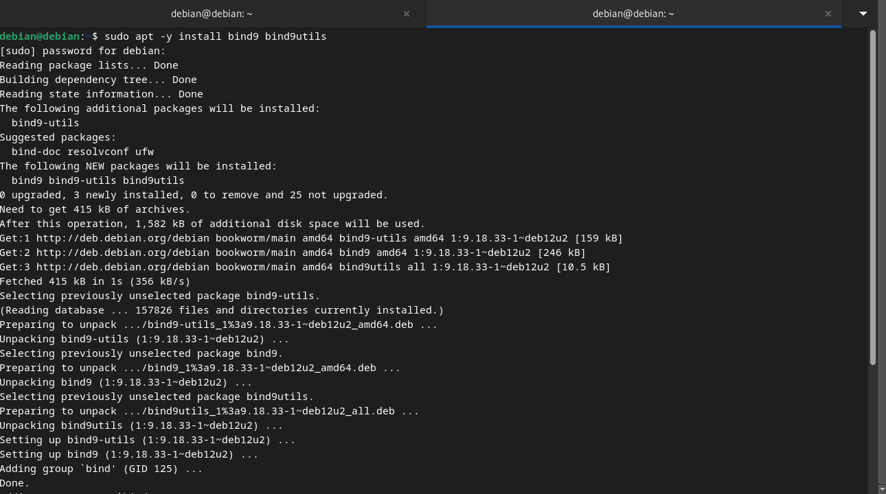

### [2] Configure BIND

First, get to `/etc/bind/` directory, and configure `named.conf` file to include the internal-zones configuration file

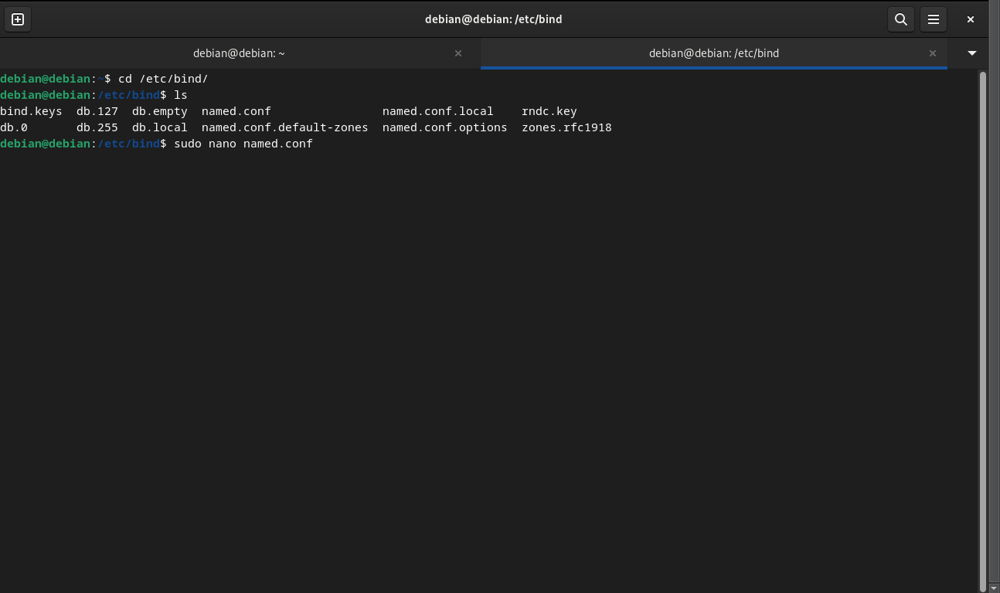

```bash
# add
include "/etc/bind/named.conf.internal-zones";
```

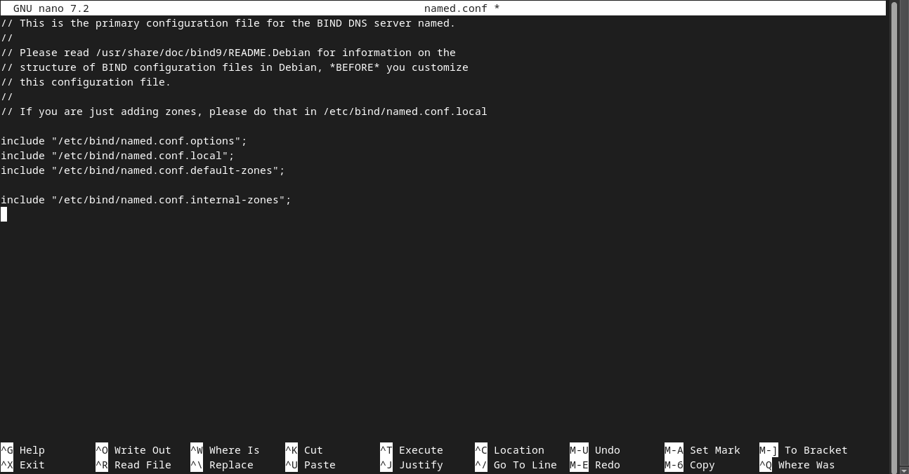

next, configure `named.conf.options` file to add local network

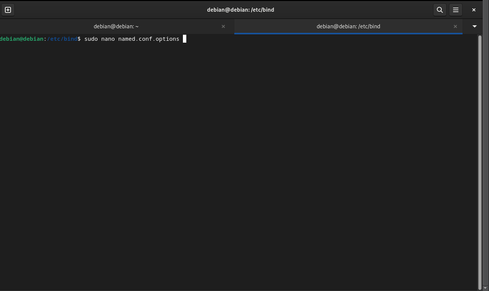

```bash
# add : set ACL entry for local network
acl internal-network {
        [your-netowrk-address]/24;
};

options {
        directory "/var/cache/bind";

.....
.....

        # add local network set on [acl] section above
        # network range you allow to recieve queries from hosts
        allow-query { localhost; internal-network; };
        # network range you allow to transfer zone files to clients
        # add secondary DNS servers if it exist
        allow-transfer { localhost; };
        # add : allow recursion
        recursion yes;

        //=======================================================================
        // If BIND logs error messages about the root key being expired,
        // you will need to update your keys.  See https://www.isc.org/bind-keys
        //=======================================================================

        dnssec-validation auto;

        # if not listen IPV6, change [any] to [none]
        listen-on-v6 { any; };
};
```

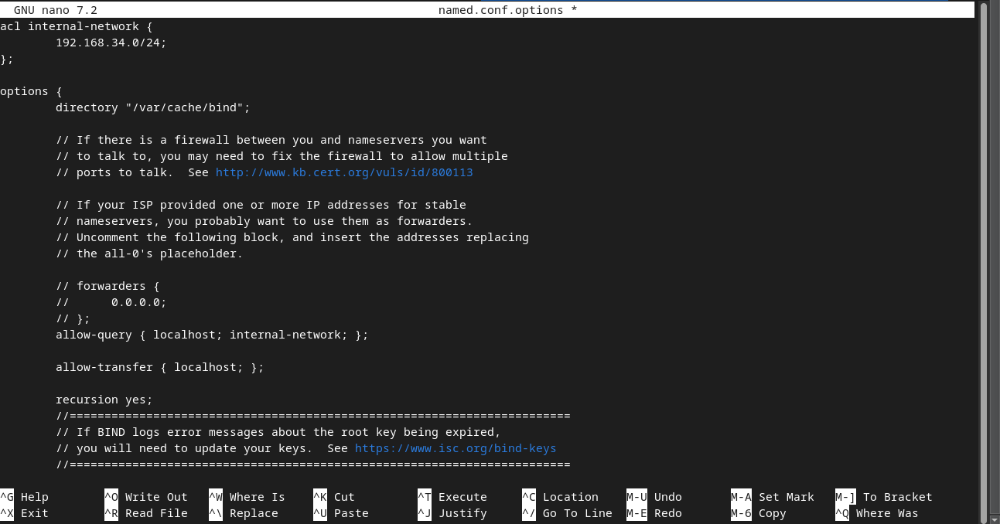

next, create and configure `named.conf.internal-zones` file to add zones for network and domain name

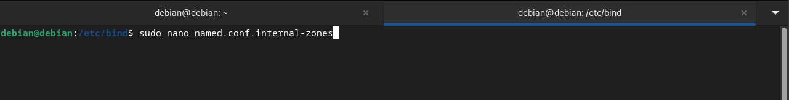

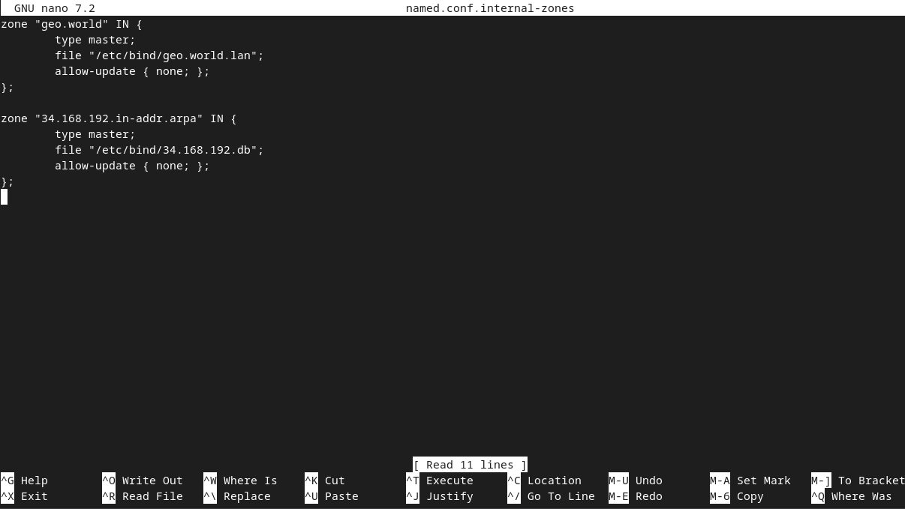

For how to write the section `[*.*.*.*.in-addr.arpa]`, write your netowrk address reversely like follows
```bash
# case of 10.0.0.0/24
network address     ⇒ 10.0.0.0
network range       ⇒ 10.0.0.0 - 10.0.0.255
how to write        ⇒ 0.0.10.in-addr.arpa
```

```bash
# case of 192.168.1.0/24
network address     ⇒ 192.168.1.0
network range       ⇒ 192.168.1.0 - 192.168.1.255
how to write        ⇒ 1.168.192.in-addr.arpa
```

Set BIND to only use IPv4

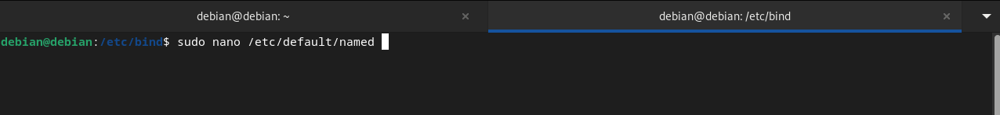

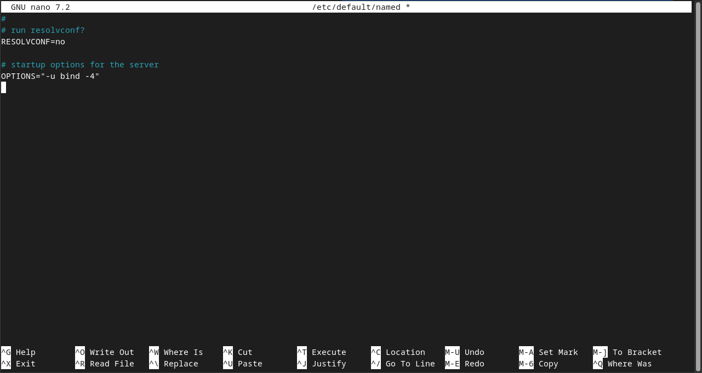

### [3] Configure Zone Files

Create zone files that servers resolve IP address from Domain name.

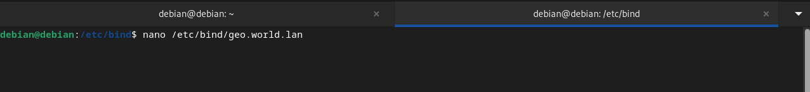

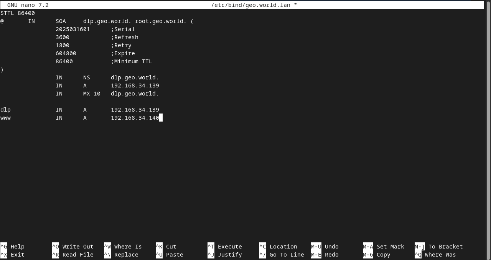

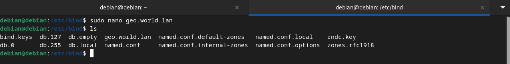

Create zone files that servers resolve Domain name from IP address.

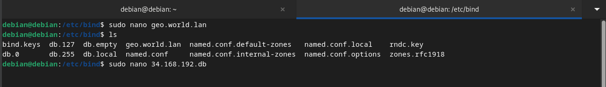

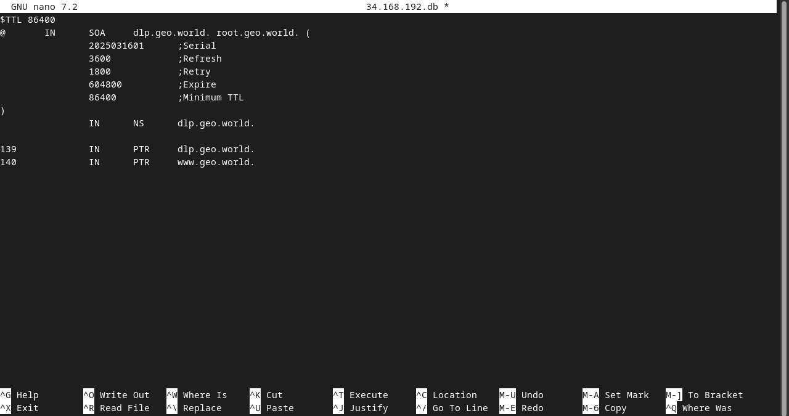

### [4] Verify Resolution

Restart BIND to apply changes.

```bash
systemctl restart named
```
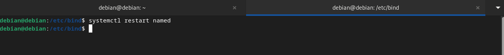

Change DNS Setting to refer to own DNS

```bash
sudo nano /etc/resolv.conf
```
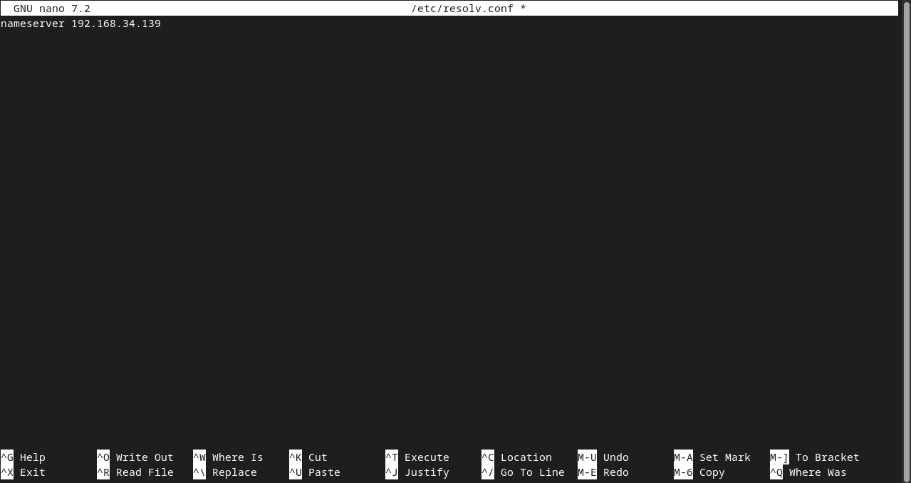

Verify Name and Address Resolution. If `[ANSWER SECTION]` is shown, that's OK.

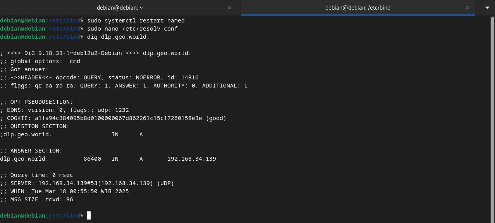

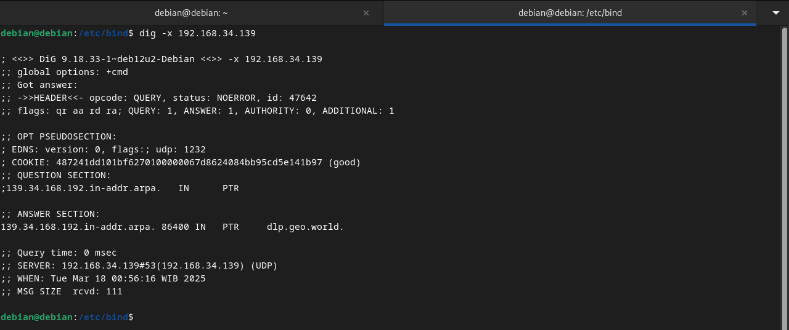
